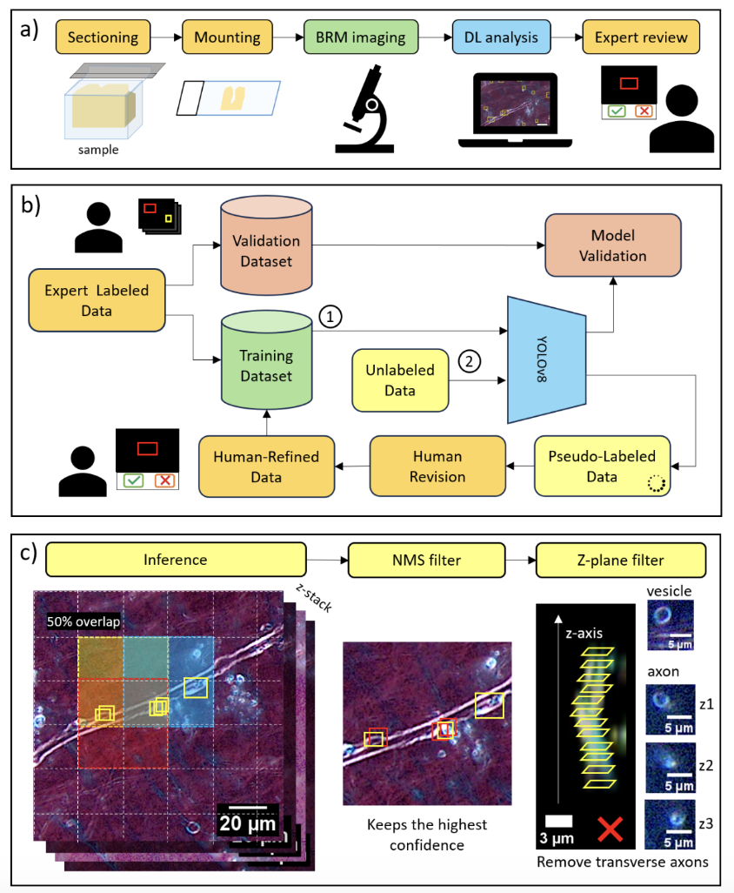

# Accelerating Myelin Defect Detection in Neurodegenerative Disorders: A Human-in-the-Loop Deep Learning Approach with Birefringence Microscopy

## Overview 
This repository hosts the code to train YOLOv8 for myelin defect detection using birefringence microscopy. The full human-in-the-loop workflow of our method is shown below from tissue preparation to final analysis.




## Data
You can view and download our dataset on Roboflow [here](https://universe.roboflow.com/defecttraining/myelin-defect-detection-s89w2). You should download the dataset in YOLOv8 format. 

If you are annotating your own volumetric imaging, you can use our custom annotation software located in the `annotation` directory. This will ensure your annotations are compatible with the preprocessing and training scripts. You will need to use [MATLAB R2024a](https://www.mathworks.com/products/new_products/release2024a.html) to run the software.


## Best Models 
To check out our best models, you can find the model weights in the `models` directory. It contains the following models along with their associated hyperparameter configuration files: 
- `best_rgb.pt`: Best model trained on 8-bit RGB images.
- `best_grayscale.py`: Best model trained on 8-bit RGB images converted to grayscale by applying (R,G,B) $\rightarrow$ (G,G,G).

You can then perform the initial setup and jump to the [inference](#inference) section to run inference with the models. 


## Usage 

This project uses [conda](https://conda.org/) to manage dependencies. To get started, you should first install miniconda by following the directions  [here](https://www.anaconda.com/docs/getting-started/miniconda/install). Once you have miniconda set up, you can first install the necessary libraries by placing yourself in the root directory of this project and running:
```
conda env create -f environment.yml
```
*Building the environment from the `environment.yml` file will only work on **Linux** systems. For other operating systems, you will need to install dependencies manually. 

This will create a conda environment called `detection_env`. To use this environment, you should run: 
```
conda activate detection_env
```

Once you have installed the necessary libraries and activated the environment, you can follow the steps below to run code for specfic stages of the pipeline. **All of the code should be run from the root directory of the project** (i.e. the directory that this file is in).


### Initial Set Up 

To run the preprocessing and postprocessing scripts, you will first need to modify the file `src/config.py` for the classes in your dataset. It is currently set up with this example:
```
# Set these to the class names in the dataset
CLASS_NUM = {
    "Defect": 0,
    "Swelling": 1,
    "Vesicle": 2,
}

# Set these to the colors for each class for annotation software
COLOR_ENCODING = {
    "Defect": [1, 0, 0],
    "Swelling": [0, 1, 0],
    "Vesicle": [0, 0, 1],
}
```
The classes in `CLASS_NUM` should start from `0,1,2...`. The `COLOR_ENCODING` is the RGB values for the bounding boxes as you want them to appear in the annotation software. Also, if you are using background bounding boxes, these should have a class name of `"Background"`, but this does **not** need to be added to the `src/config.py` file. 


### Preprocessing

To run the preprocessing script, you will need to have your annotations set up in a single directory that contains both `.tif` images and their corresponding `.mat` files. You should also decide which image(s) will be used for validation. Then run the preprocessing script like this: 

```
python -m src.preprocessing.main --data_path path/to/data/directory --val_images image1 image2 --image_type rgb
```
The required arguments are: 
- `data_path`: Path to data directory containing `.tif` images and their corresponding `.mat` files.
- `val_images`: Space separate list of `.tif` images to be used for validation. These should be file names relative to the `data_path`. For example: `--val_images 11_X32342_Y17459.tif 11_X33898_Y17770.tif`.
- `image_type`: The type of the image. This can be either `rgb` for 8-bit RGB images or `grayscale` for 16-bit grayscale images.


The script will create a `results` directory in the current working directory with a structure like: 
```
results
    |train
        |images
        |labels
    |val
        |images
        |labels
```
You should manually delete or rename the `results` directory every time you want to rerun the preprocessing script. 

To see the full list of supported arguments for preprocessing, you can use: 
```
python -m src.preprocessing.main --help
```
You will likely want to modify some of the optional arguments. For example, a smaller window size (`window_size`) generally works better for training, but you will want the window size to still be bigger than all of the bounding boxes. Also, if you are including background bounding boxes to reduce false positives, you may want to play around with how many background bounding boxes you include. For this, you can use the `background_frac` argument. For example, to use a window size of 200 x 200 px keeping 50% of the background annotations you would run: 
```
python -m src.preprocessing.main --data_path path/to/data/directory --val_images image1 image2 --image_type rgb --window_size 200 --background_frac 0.5
```

### Training & Hyperparameter Tuning

For training, you will need to modify `src/training/data.yaml`. It is currently set up with this example:
```
path:                #set the path here to the results dir created in preprocessing
train: train/images 
val: valid/images    

# Class encodings - set these to your own class names as before
names:
  0: Defect
  1: Swelling
  2: Vesicle
```
You should modify the `data.yaml` file following the comments in the code block above. More documentation for this is available [here](https://docs.ultralytics.com/yolov5/tutorials/train_custom_data/#11-create-datasetyaml). The training and hyperparameter tuning scripts in `src/training` are simple examples of how to set up training with [Ultralytics](https://www.ultralytics.com/). To use these scripts, you should modify the `data_path` variable inside the script to point to your `data.yaml` file. You can then run one of the following: 
```
python -m src.training.train
python -m src.training.tune
```
The training/tuning runs will be saved in a new `runs` directory in the current working directory. If you are running hyperparameter tuning, you will see several training runs saved in the `runs` directory. In addition to saving a directory for each training run, you will also see a `tune` directory. You can find the best model from hyperparameter tuning in the `tune/best_hyperparameters.yaml` file. The best model is decided based on a `fitness` metric, which is computed as:
 ```
 fitness = 0.1 * (mAP@0.5) + 0.9 * (mAP@0.5:0.95)
 ```


For full documentation to modify parameters in the scripts refer to the official [training docs](https://docs.ultralytics.com/modes/train/) and [hyperparameter tuning docs](https://docs.ultralytics.com/guides/hyperparameter-tuning/). For hyperparameter tuning, if you are using [SCC](https://www.bu.edu/tech/support/research/computing-resources/scc/), you will likely want to submit it as a batch job. For this, you can refer to the example in `src/training/tune.sh`.

**Note on transfer learning:** Both the training and tuning scripts are set up to load the COCO-pretrained YOLOv8-nano model to initialize training. This is a form of transfer learning, where we initialize the model from pretrained weights and transfer it to a new task where we may have limited data. Often, this can outperform training the model weights from scratch. If you would like to use transfer learning with a different set of YOLOv8-nano model weights, or train the weights from scratch, you can change the file path on this line: 
```
model = YOLO("path/to/your/weights/.pt")   # transfer learning with your own model
model = YOLO("yolov8n.yaml")               # training from scratch
```

### Inference

To run the inference code, you should have a `.pt` file for the YOLO model you would like to use. You can find this file from your training runs in a folder like `runs/detect/train/weights`. You should also have a directory containing `.tif` or `.btf` images that you would like the model to annotate. You can then run: 
```
python -m src.inference.main --data_path path/to/data/directory --model_path path/to/.pt/model --image_type rgb
```
The corresponding `.mat` files will be created in the same directory as `data_path`. The required arguments are: 
- `data_path`: Path to data directory containing `.tif` or `.btf` images to be annotated by the model. 
- `model_path`: Path to `.pt` file for the model to use for inference. 
- `image_type`: The type of the image. This can be either `rgb` for 8-bit RGB images or `grayscale` for 16-bit Grayscale images. 

To see the full list of supported arguments for inference, you can use: 
```
python -m src.inference.main --help
```
You will likely want to modify some of the optional arguments again. Here are some guidelines for this: 
- The window size (`window_size`) should be set to the same window size used for preprocessing and training.
- The confidence threshold (`conf_threshold`) should be set based on the model. A good choice is to set the confidence threshold to the threshold that maximizes the F1 score. You can find this by looking at the generated `F1_curve.png` in the directory for the model you are using.  
- The batch size (`batch_size`) should be set based on GPU-specific memory constraints. 


### Postprocessing 

Currently the postprocessing script is set up to sort the model's annotations so that bounding boxes which belong to the same defect annotation in consecutive z-planes appear sequentially in the `.mat` file. This helps when viewing the image in the annotation software. To run the script, you should have a directory containing `.mat` files that you would like to postprocess. You can then run: 

```
python -m src.postprocessing.main --data_path path/to/data/directory
```

A new `postprocessed` directory will be created in the current working directory with a corresponding postprocessed `.mat` file for each original `.mat` file in the `data_path` directory. You can also run the postprocessing script to remove vesicles detections in at least 3 consecutive z-planes as these are likely to be transverse axons. If this is needed, you can run:  
```
python -m src.postprocessing.main --data_path path/to/data/directory --remove_transverse_axons
```
You should manually delete or rename the `postprocessed` directory every time you want to rerun the postprocessing script. To see the full list of supported arguments for postprocessing, you can use: 
```
python -m src.postprocessing.main --help
```


